# segmentation-co-training

## Installation

1. Clone this repository

2. [OPTIONAL] Create your virtual enviroment and activate it

3. Install [OpenSlide](https://openslide.org/download/)

4. Install the requirements

   `pip install -r requirements`

5. Install pytorch following the instructions provided on the page [pytorch.org/get-started/locally/](https://pytorch.org/get-started/locally/)

6. Make a copy of the configuration file and update it properly
   `cp settings.py.template settings.py`


## Usage

The main rule is running everything from the `main.py`

### Running tests

1. Make `get_test_datasets.sh` executable and download the testing datasets

	``` shell
	chmod +x get_test_datasets.sh
	./get_test_datasets.sh
	```

2. Make `run_tests.sh` executable and run it:

	```shell
	chmod +x run_tests.sh
	./run_tests.sh
	```

### Running TensorBoard

1. Make `run_tensorboard.sh` executable:

	`chmod +x run_tensorboard.sh`

2. Execute it

	`./run_tensorboard.sh`


### Debugging

Just open your `settings.py` and set `DEBUG = True`. This will set the log level to debug and your dataloader will not use workers so you can use `pdb.set_trace()` without any problem.

## Main Features

**Note**: Always see the class or function definition to pass the correct parameters and see all available options.

### [CoNSep](https://warwick.ac.uk/fac/cross_fac/tia/data/hovernet/) dataset
See [consep/README.md](consep/README.md)

### TCIA Pancreas CT-82 [^1][^2][^3]
See [ct82/README.md](ct82/README.md)


### LiTS17 [^4]
See [lits17/docs/README.md](lits17/README.md)


### Predict masks for whole CT scans and visualize them
1. Modify your model manager to support these feature using the `CT3DNIfTIMixin`. E.g.:

``` python
class CTModelMGR(CT3DNIfTIMixin, ModelMGR):
    pass
```

2. Replace your old ModelMGR by the new one and provide and initial weights

``` python
mymodel = CTModelMGR(
	...
	ini_checkpoint='<path to your best checkpoint>',
	...
)
```

3. Make the 3D mask prediction

``` python
mymodel.predict('<path to your CT folder>/CT_119.nii.gz')
```

4. Visualize all the 2D masks

``` python
id_ = '119'

mymodel.plot_2D_ct_gt_preds(
	ct_path=f'<path to your CT folder>/CT_{id_}.nii.gz',
	gt_path=f'<path to your CT folder>/label_{id_}.nii.gz',
    pred_path=f'pred_CT_{id_}.nii.gz'
)
```


### Training, Testing and Plotting on TensorBoard
Use the `ModelMGR` to train models and make predictions.

``` python
import logzero

import torch
from gtorch_utils.nns.models.segmentation import UNet
from gtorch_utils.segmentation import torchmetrics

import numpy as np
import settings
from consep.dataloaders import OfflineCoNSePDataset
from consep.datasets.constants import BinaryCoNSeP
from nns.managers import ModelMGR
from nns.mixins.constants import LrShedulerTrack
from nns.utils.metrics import MetricItem


logzero.loglevel(settings.LOG_LEVEL)

ModelMGR(
    model=UNet,
	model_kwargs=dict(n_channels=3, n_classes=1, bilinear=True),
    cuda=True,
	multigpus=True,
	patch_replication_callback=False,
    epochs=20,
    intrain_val=2,
    optimizer=torch.optim.Adam,
    optimizer_kwargs=dict(lr=1e-3),
    labels_data=BinaryCoNSeP,
    dataset=OfflineCoNSePDataset,
    dataset_kwargs={
        'train_path': settings.CONSEP_TRAIN_PATH,
        'val_path': settings.CONSEP_VAL_PATH,
        'test_path': settings.CONSEP_TEST_PATH,
    },
    train_dataloader_kwargs={
        'batch_size': settings.TOTAL_BATCH_SIZE, 'shuffle': True, 'num_workers': settings.NUM_WORKERS, 'pin_memory': False
    },
    testval_dataloader_kwargs={
        'batch_size': settings.TOTAL_BATCH_SIZE, 'shuffle': False, 'num_workers': settings.NUM_WORKERS, 'pin_memory': False, 'drop_last': True
    },
    lr_scheduler=torch.optim.lr_scheduler.ReduceLROnPlateau,  # torch.optim.lr_scheduler.StepLR,
    # the mode can change based on the quantity monitored
    # get inspiration from https://pytorch-lightning.readthedocs.io/en/latest/common/lightning_module.html#configure-optimizers
    lr_scheduler_kwargs={'mode': 'min', 'patience': 2},  # {'step_size': 10, 'gamma': 0.1},
    lr_scheduler_track=LrShedulerTrack.LOSS,
    criterions=[
        torch.nn.BCEWithLogitsLoss()
        # torch.nn.CrossEntropyLoss()
    ],
    mask_threshold=0.5,
    metrics=[
        MetricItem(torchmetrics.DiceCoefficient(), main=True),
        MetricItem(torchmetrics.Specificity(), main=True),
        MetricItem(torchmetrics.Recall())
    ],
	metric_mode=MetricEvaluatorMode.MAX,
    earlystopping_kwargs=dict(min_delta=1e-3, patience=np.inf, metric=True),
    checkpoint_interval=1,
    train_eval_chkpt=True,
    ini_checkpoint='',
    dir_checkpoints=settings.DIR_CHECKPOINTS,
    tensorboard=True,
    # TODO: there a bug that appeared once when plotting to disk after a long training
    # anyway I can always plot from the checkpoints :)
    plot_to_disk=False,
    plot_dir=settings.PLOT_DIRECTORY
)()
```

### Showing Logs Summary from a Checkpoint
Use the `ModelMGR.print_data_logger_summary` method to do it.

``` python
model = ModelMGR(<your settings>, ini_checkpoint='chkpt_X.pth.tar', dir_checkpoints=settings.DIR_CHECKPOINTS)
model.print_data_logger_summary()
```

The summary will be a table like this one

| key         | Validation   |   corresponding training value |
|-------------|--------------|--------------------------------|
| Best metric | 0.7495       |                         0.7863 |
| Min loss    | 0.2170       |                         0.1691 |
| Max LR      |              |                         0.001  |
| Min LR      |              |                         1e-07  |

### Run Co-Training algorithm
Currently, this implementation only support two models for the binary case

1. Define two dictionaries, one per each model,  containined all the data to be used by the `ModelMGR`

   ``` python
    import os

    import torch
    from gtorch_utils.nns.models.segmentation import UNet_3Plus
    from gtorch_utils.nns.models.segmentation.unet3_plus.constants import UNet3InitMethod
    from gtorch_utils.segmentation import metrics

    import settings
    from consep.dataloaders import OfflineCoNSePDataset
    from consep.datasets.constants import BinaryCoNSeP
    from nns.backbones import xception
    from nns.callbacks.metrics.constants import MetricEvaluatorMode
    from nns.mixins.constants import LrShedulerTrack
    from nns.models import Deeplabv3plus
    from nns.segmentation.learning_algorithms import CoTraining
    from nns.segmentation.utils.postprocessing import ExpandPrediction
    from nns.utils.sync_batchnorm import get_batchnormxd_class


    model1 = dict(
        model=UNet_3Plus,
        model_kwargs=dict(n_channels=3, n_classes=1, is_deconv=False, init_type=UNet3InitMethod.KAIMING,
                          batchnorm_cls=get_batchnormxd_class()),
        cuda=settings.CUDA,
        multigpus=settings.MULTIGPUS,
        patch_replication_callback=settings.PATCH_REPLICATION_CALLBACK,
        epochs=20,  # 20
        intrain_val=2,  # 2
        optimizer=torch.optim.Adam,
        optimizer_kwargs=dict(lr=1e-3),
        labels_data=BinaryCoNSeP,
        dataset=OfflineCoNSePDataset,
        dataset_kwargs={
            'train_path': settings.CONSEP_TRAIN_PATH,
            'val_path': settings.CONSEP_VAL_PATH,
            'test_path': settings.CONSEP_TEST_PATH,
            'cotraining': settings.COTRAINING,
        },
        train_dataloader_kwargs={
            'batch_size': settings.TOTAL_BATCH_SIZE, 'shuffle': True, 'num_workers': settings.NUM_WORKERS, 'pin_memory': False
        },
        testval_dataloader_kwargs={
            'batch_size': settings.TOTAL_BATCH_SIZE, 'shuffle': False, 'num_workers': settings.NUM_WORKERS, 'pin_memory': False, 'drop_last': True
        },
        lr_scheduler=torch.optim.lr_scheduler.ReduceLROnPlateau,
        lr_scheduler_kwargs={'mode': 'min', 'patience': 2},
        lr_scheduler_track=LrShedulerTrack.LOSS,
        criterions=[
            torch.nn.BCEWithLogitsLoss()
        ],
        mask_threshold=0.5,
        metric=metrics.dice_coeff_metric,
        metric_mode=MetricEvaluatorMode.MAX,
        earlystopping_kwargs=dict(min_delta=1e-3, patience=10, metric=True),
        checkpoint_interval=0,
        train_eval_chkpt=False,
        ini_checkpoint='',
        dir_checkpoints=os.path.join(settings.DIR_CHECKPOINTS, 'consep', 'cotraining', 'exp43', 'unet3_plus'),
        tensorboard=False,
        plot_to_disk=False,
        plot_dir=settings.PLOT_DIRECTORY
    )

    model2 = dict(
        model=Deeplabv3plus,
        model_kwargs=dict(
            cfg=dict(model_aspp_outdim=256,
                     train_bn_mom=3e-4,
                     model_aspp_hasglobal=True,
                     model_shortcut_dim=48,
                     model_num_classes=1,
                     model_freezebn=False,
                     model_channels=3),
            batchnorm=get_batchnormxd_class(), backbone=xception, backbone_pretrained=True,
            dilated=True, multi_grid=False, deep_base=True
        ),
        cuda=settings.CUDA,
        multigpus=settings.MULTIGPUS,
        patch_replication_callback=settings.PATCH_REPLICATION_CALLBACK,
        epochs=20,  # 20
        intrain_val=2,  # 2
        optimizer=torch.optim.Adam,
        optimizer_kwargs=dict(lr=1e-3),
        labels_data=BinaryCoNSeP,
        dataset=OfflineCoNSePDataset,
        dataset_kwargs={
            'train_path': settings.CONSEP_TRAIN_PATH,
            'val_path': settings.CONSEP_VAL_PATH,
            'test_path': settings.CONSEP_TEST_PATH,
            'cotraining': settings.COTRAINING,
        },
        train_dataloader_kwargs={
            'batch_size': settings.TOTAL_BATCH_SIZE, 'shuffle': True, 'num_workers': settings.NUM_WORKERS, 'pin_memory': False
        },
        testval_dataloader_kwargs={
            'batch_size': settings.TOTAL_BATCH_SIZE, 'shuffle': False, 'num_workers': settings.NUM_WORKERS, 'pin_memory': False, 'drop_last': True
        },
        lr_scheduler=torch.optim.lr_scheduler.ReduceLROnPlateau,
        lr_scheduler_kwargs={'mode': 'min', 'patience': 2},
        lr_scheduler_track=LrShedulerTrack.LOSS,
        criterions=[
            torch.nn.BCEWithLogitsLoss()
        ],
        mask_threshold=0.5,
        metric=metrics.dice_coeff_metric,
        metric_mode=MetricEvaluatorMode.MAX,
        earlystopping_kwargs=dict(min_delta=1e-3, patience=10, metric=True),
        checkpoint_interval=0,
        train_eval_chkpt=False,
        ini_checkpoint='',
        dir_checkpoints=os.path.join(
            settings.DIR_CHECKPOINTS, 'consep', 'cotraining', 'exp43', 'deeplabv3plus_xception'),
        tensorboard=False,
        plot_to_disk=False,
        plot_dir=settings.PLOT_DIRECTORY
    )
   ```

2. Define and execute your `CoTraining` instance

   ``` python
    cot = CoTraining(
        model_mgr_kwargs_list=[model2, model3],
        iterations=5,
        metric=metrics.dice_coeff_metric,
        earlystopping_kwargs=dict(min_delta=1e-3, patience=2),
        warm_start=dict(lamda=.0, sigma=.0),
        dir_checkpoints=os.path.join(settings.DIR_CHECKPOINTS, 'consep', 'cotraining', 'exp43'),
        thresholds=dict(disagreement=(.25, .8)),
        plots_saving_path=settings.PLOT_DIRECTORY,
        strategy_postprocessing=dict(
            disagreement=[ExpandPrediction(), ],
        ),
        general_postprocessing=[],
        postprocessing_threshold=.5,
        dataset=OfflineCoNSePDataset,
        dataset_kwargs={
            'train_path': settings.CONSEP_TRAIN_PATH,
            'val_path': settings.CONSEP_VAL_PATH,
            'test_path': settings.CONSEP_TEST_PATH,
            'cotraining': settings.COTRAINING,
        },
        train_dataloader_kwargs={
            'batch_size': settings.TOTAL_BATCH_SIZE, 'shuffle': True, 'num_workers': settings.NUM_WORKERS, 'pin_memory': False
        },
        testval_dataloader_kwargs={
            'batch_size': settings.TOTAL_BATCH_SIZE, 'shuffle': False, 'num_workers': settings.NUM_WORKERS, 'pin_memory': False, 'drop_last': True
        }
    )
    cot()
   ```

3. Print a summary of the data logger and a line chart of each model and their combined results

   ``` python
    cot.print_data_logger_summary(
        os.path.join(settings.DIR_CHECKPOINTS, 'consep', 'cotraining', 'exp43', 'chkpt_2.pth.tar'))

    cot.plot_and_save(
        os.path.join(settings.DIR_CHECKPOINTS, 'consep', 'cotraining', 'exp43', 'chkpt_2.pth.tar'),
        save=True, show=False, dpi=300.
    )
   ```

### Cotraining tools

#### ExpandPrediction
Use this class to post-process the cotraining masks between iterations. This class intersects the cotraining results with the combined predicted masks, from both models using the `postprocessing_threshold`; and returns masks containing the hole predicted areas for each intersection. The intuition behind this tool is the folowing: if we are working with the disagreement strategy, the disagreement new areas in the training mask can be tiny, making the learning process hard because a few pixels are not going to provide too much information. In this sense, the `ExpandPrediction` class will return the whole combined prediced areas (based on `postprocessing_threshold`) that are intersected by those disagreement pixels. Thus, the new cotraining masks will have new and wider areas/annotations which contains at least one disagreement pixel.

This class can be used along with the `CoTraining` class as shown in the second point of the Co-Training section [link](https://github.com/giussepi/segmentation-co-training#run-co-training-algorithm) and separately (and example is shown in subsequent paragraphs). When used in the CoTraining class the combined predictions and disagreement/agreement/self-combined masks are merged with the current ground truth mask. This is part of the integration with the co-training training algorithm.

Some examples are shown below: (In most of the cases the images from left to right are the combined predictions mask, disagreement mask and expanded disagreement mask.)

1. Expanding a few disagreement pixels. In this case, the image in the left is the ground thruth mask, the one in the middle is the disagreement mask, and the last one if the expanded disagreement mask.

	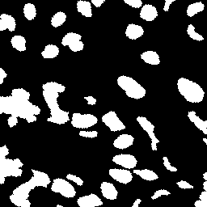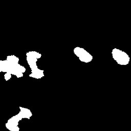

	The code to test it:

	``` python
    import numpy as np
    import torch

    import matplotlib.pyplot as plt
    from PIL import Image

    from nns.segmentation.utils.postprocessing import ExpandPrediction


    pred = Image.open('imgs/ExpandPrediction/1.mask.png')
    subpred = Image.open('imgs/ExpandPrediction/1.sub_mask.png')

    pred = np.array(pred.convert('L')) if pred.mode != 'L' else np.array(pred)
    subpred = np.array(subpred.convert('L')) if subpred.mode != 'L' else np.array(subpred)

    pred_mask = np.zeros((*pred.shape[:2], 1), dtype=np.float32)
    pred_mask[..., 0] = (pred == 255).astype(np.float32)
    pred_mask = pred_mask.transpose(2, 0, 1)

    subpred_mask = np.zeros((*subpred.shape[:2], 1), dtype=np.float32)
    subpred_mask[..., 0] = (subpred == 255).astype(np.float32)
    subpred_mask = subpred_mask.transpose(2, 0, 1)


    expanded_subpred = ExpandPrediction()(
        torch.from_numpy(subpred_mask.squeeze()),
        torch.from_numpy(pred_mask.squeeze())
    )

    plt.imshow(expanded_subpred.numpy(), cmap='gray')
    # plt.savefig('expanded_subpred.png')
    plt.show()
	```
2. No disagreement pixels. In this case the combined predictions and the disagreement predictions have been merged with the training ground truth mask.

   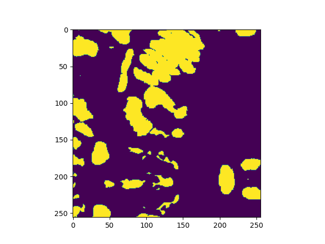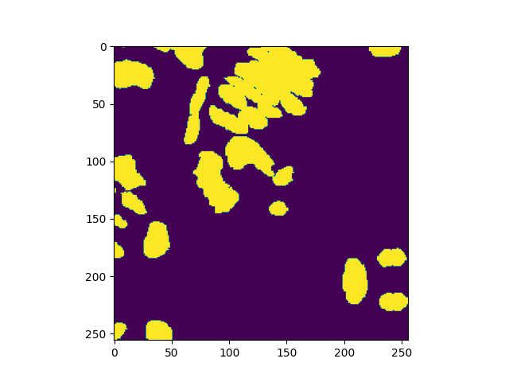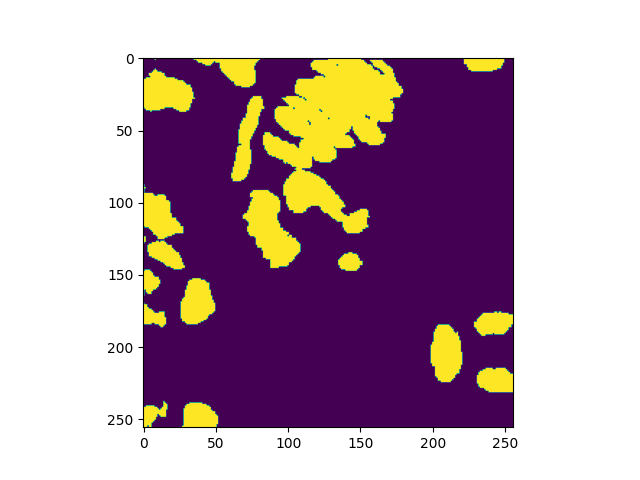

3. Regions not coverd by the disagreemet mask are removed. We hope this will reduce the number of False Positives.

   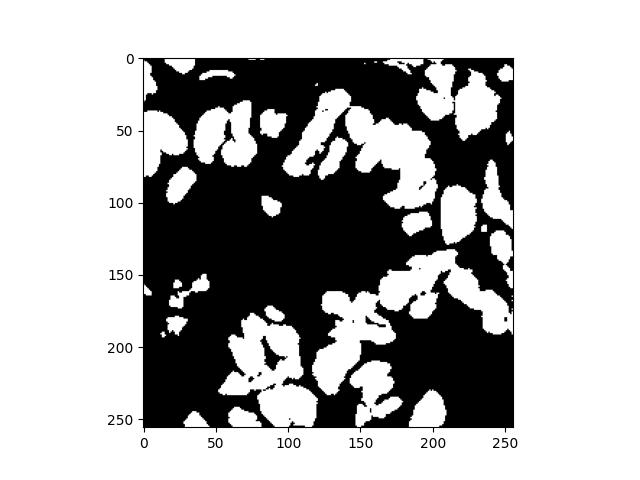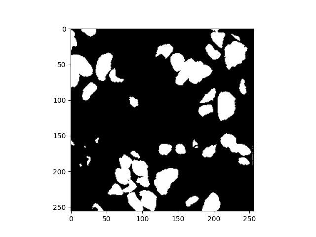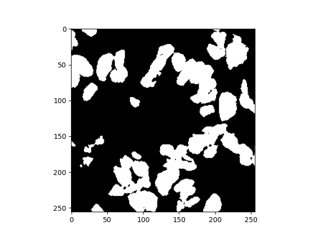

4. When there is nothing in the disagreement mask nothing the new mas will be empty too.

   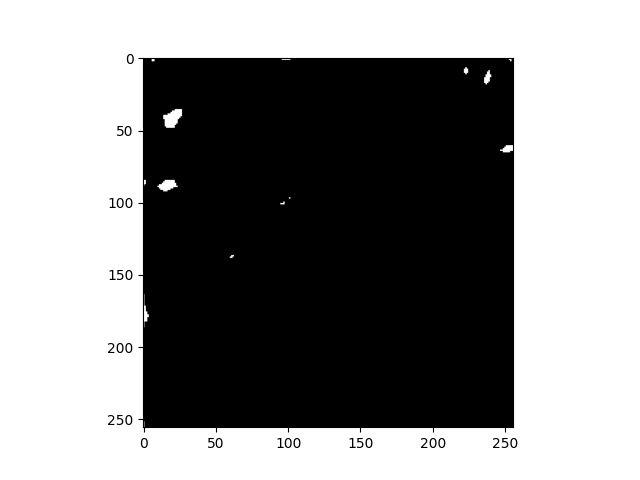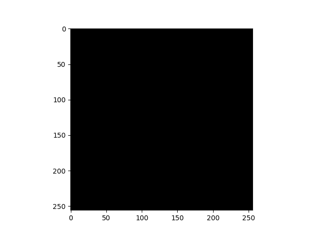

5. The disagreement not just helps expanding the disagreement pixels, it also expands a bit the ground thruth areas.

   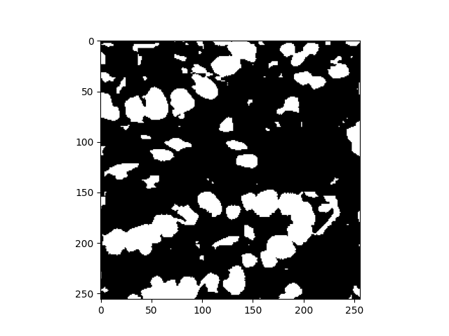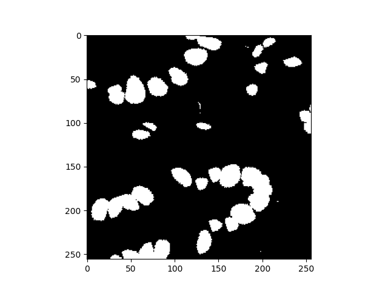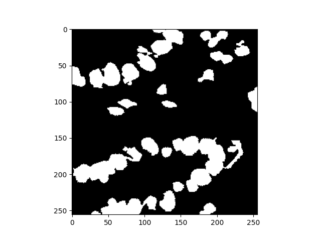

6. Another examples of how it helps to reduce, theoretically, bad predictions (false positives)

   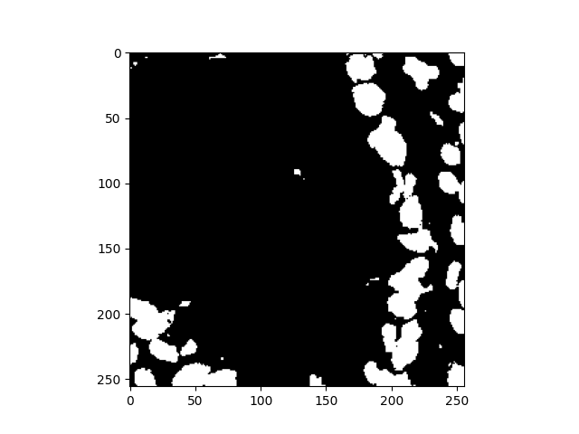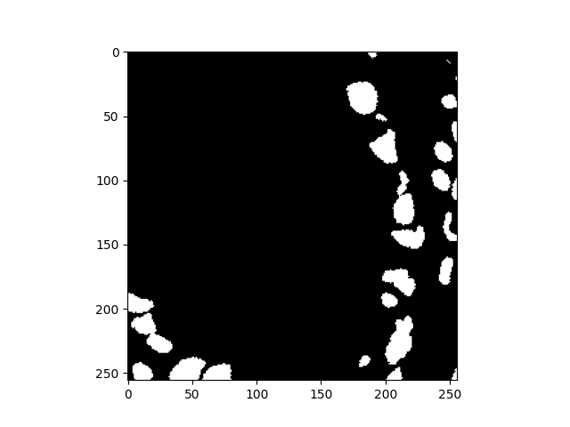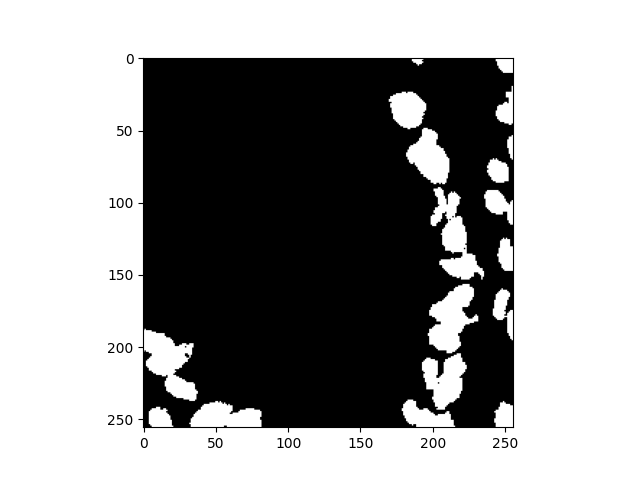

## LOGGING
This application is using [logzero](https://logzero.readthedocs.io/en/latest/). Thus, some functionalities can print extra data. To enable this just open your `settings.py` and set `DEBUG = True`. By default, the log level is set to [logging.INFO](https://docs.python.org/2/library/logging.html#logging-levels).


## TODO
- [ ] Update DAModelMGR to use BaseModelMGR, support several_crops, etc
- [ ] Modify UNet3D to support tensorboard when using 3D data
- [x] Review issue about passing the skip connections (in all DA models)
- [x] Update all DA models to use batchnorm_cls and init_type properly (like UNet_3Plus_Intra_DA)
- [x] Review that AttentionBlock is properly used everywhere!!!
- [ ] Select only the attention unet and remove the other one
- [ ] AttentionMergingBlock.forward think how it should work to make the models separable
- [ ] AttentionMergingBlock: if there's time. Implement the other ways of merging the attentions
- [ ] DAModelMGR: Pass training metrics to forward pass when using DAModelManagers
  For now I'm passing zeroes as metrics [self.model(imgs, 0., 0.)] and using
  da_threshold=np.NINF to have always apply DA
- [ ] UNet_3Plus_DA_Train, UNet_3Plus_DA2_Train, UNet_3Plus_DA2ext_Train: fix x1_, x2 issue in the forward pass
- [x ] Attention UNet: add batchnorm_cls and init_type


[^1]: Holger R. Roth, Amal Farag, Evrim B. Turkbey, Le Lu, Jiamin Liu, and Ronald M. Summers. (2016). Data From Pancreas-CT. The Cancer Imaging Archive. [https://doi.org/10.7937/K9/TCIA.2016.tNB1kqBU](https://doi.org/10.7937/K9/TCIA.2016.tNB1kqBU)
[^2]: Roth HR, Lu L, Farag A, Shin H-C, Liu J, Turkbey EB, Summers RM. DeepOrgan: Multi-level Deep Convolutional Networks for Automated Pancreas Segmentation. N. Navab et al. (Eds.): MICCAI 2015, Part I, LNCS 9349, pp. 556–564, 2015.  ([paper](http://arxiv.org/pdf/1506.06448.pdf))
[^3]: Clark K, Vendt B, Smith K, Freymann J, Kirby J, Koppel P, Moore S, Phillips S, Maffitt D, Pringle M, Tarbox L, Prior F. The Cancer Imaging Archive (TCIA): Maintaining and Operating a Public Information Repository, Journal of Digital Imaging, Volume 26, Number 6, December, 2013, pp 1045-1057. DOI: [https://doi.org/10.1007/s10278-013-9622-7](https://doi.org/10.1007/s10278-013-9622-7)
[^4]: P. Bilic et al., “The liver tumor segmentation benchmark (LiTS),” arXiv e-prints, p. arXiv:1901.04056, Jan. 2019. [Online]. Available: [https://arxiv.org/abs/1901.04056](https://arxiv.org/abs/1901.04056)
